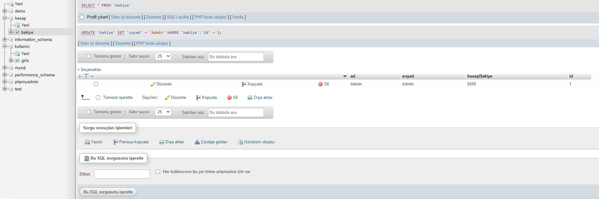
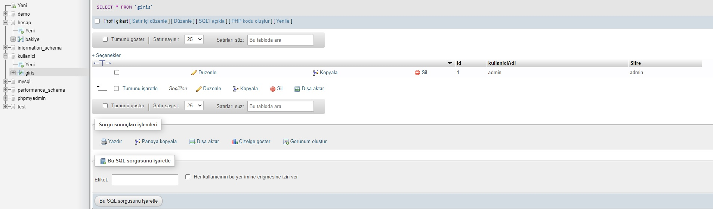
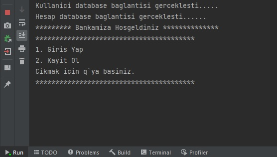
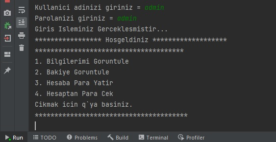

#Description
***
Bank automation works by pulling data from MySQL database.

##MySQL Connection Information
***
###Account Database Connection Information
`kullaniciAdi = "root",
kullaniciSifre = "",
host = "localhost",
dbName1 = "hesap", port = 3306`
###User Database Connection Information
`kullaniciAdi = "root",
kullaniciSifre = "",
host = "localhost",
dbName1 = "kullanici", port = 3306`

There are two databases. database names: account and user.

- The table in the account database holds the user's first name, last name and money information.

Example:

- The table in the user database holds the user's login information to the system.

Example:

##Usage
***
Bank automation login screen;

After logging in, you can do the following:

1.View My Information

2.amount of money

3.Deposit to Account

4.Withdraw money

Press q to exit.

